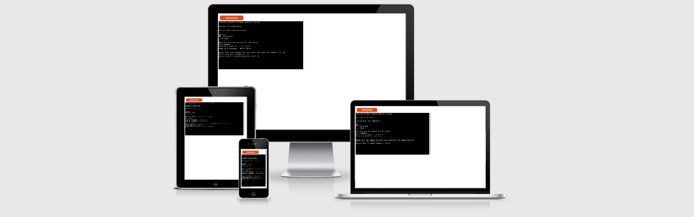
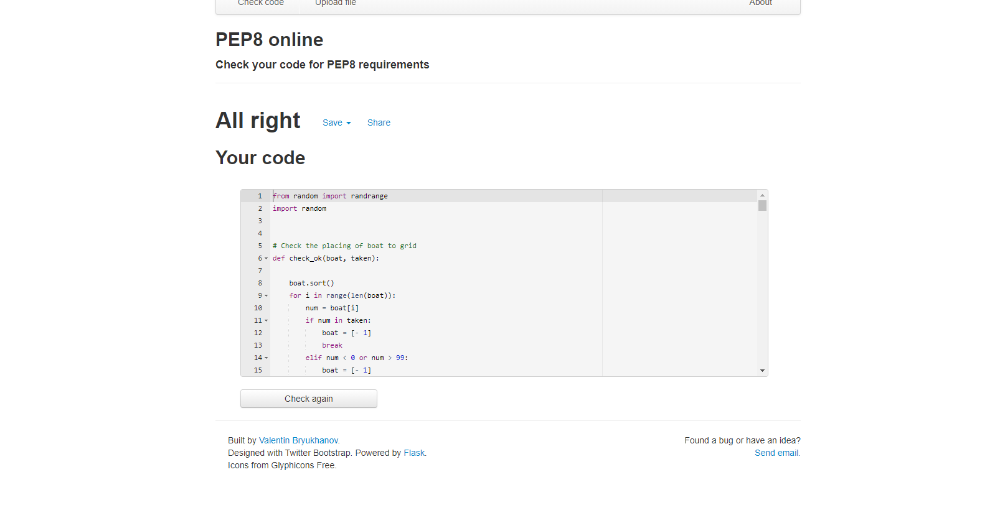
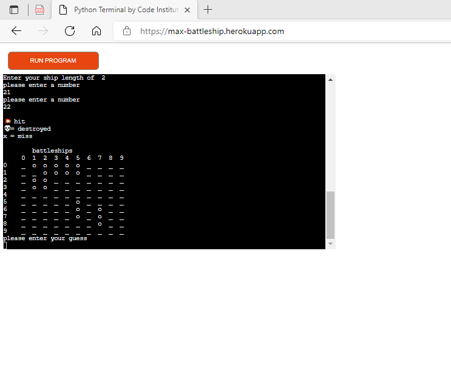
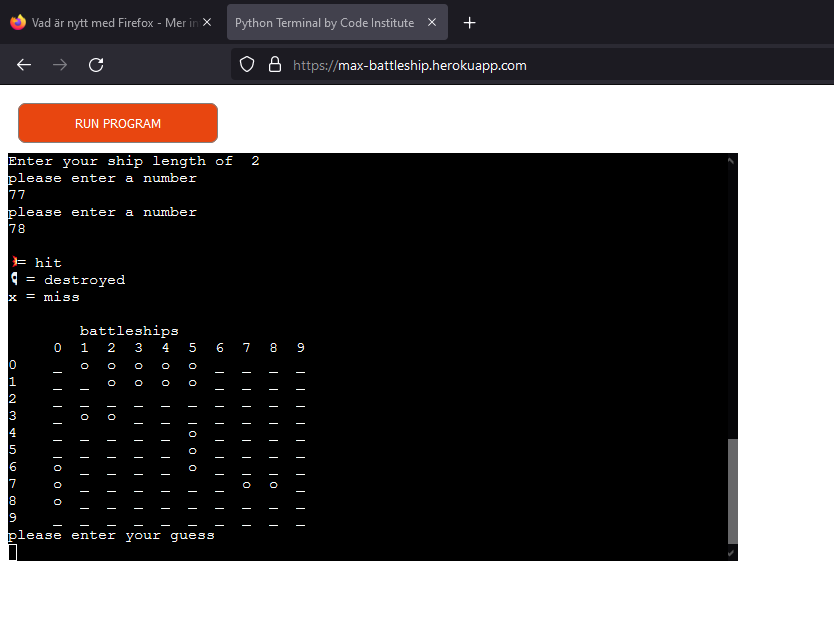
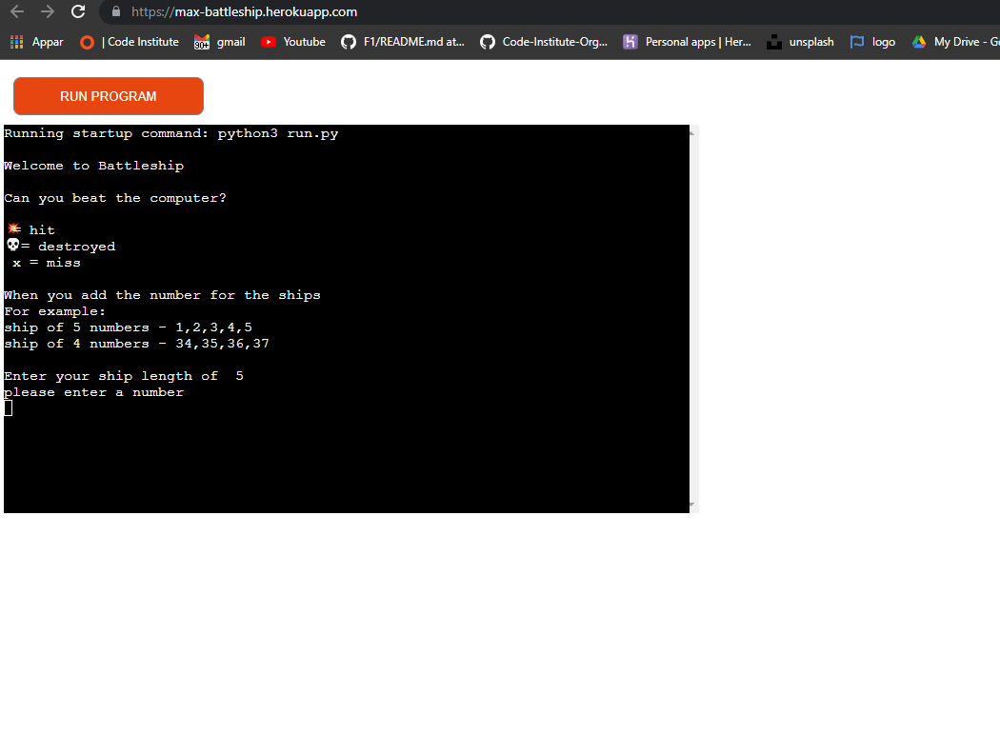
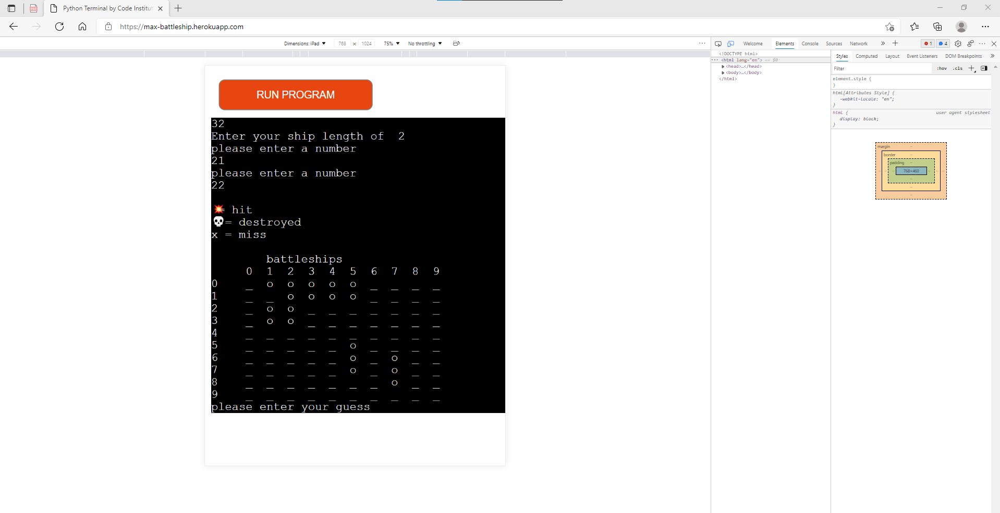
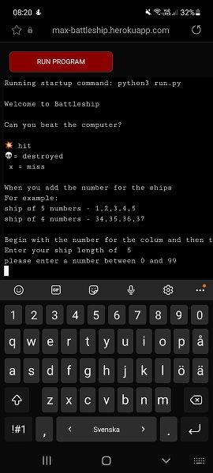

# Battleship 

Battleship is a is a strategy type guessing game.It is played on ruled grids board on which the user's fleet of ships are marked. The locations of the fleets are concealed from the computer. User and computer alternate turns calling "shots" at the other player's ships, and the objective of the game is to destroy the computers fleet.

## Features 

### Existing Features

__ The Run Program Button  __

Featured at the top of the page, 

(screenshot of button)

__ The Terminal Area  __

(screenshot of terminal)

__ The Program Structure __

(screenshot of a workflow logic for the game)

...and the other features on your project like the game-play functionality (with screenshots)...

### Features Left to Implement

- Another feature idea that I can add is to show the user how meny shots the user has left.

## Testing 

### Validator Testing 

Python (PEP8online.com)
After checking the Python code for PEP8 requirements, no errors were found

### Browser Compatibility
    - Edge browser

    - Firefox browser

    - Chrome browser

### Responsivenes

    - Desktop

    - Tablet

    - Mobile

### Unfixed Bugs

Mention of unfixed bugs and why they were not fixed 

## Deployment

This project has been deployed to Heroku.
Steps taken to deploy are as follows:

- Create a **requirements.txt** file using the terminal command `pip3 freeze --local > requirements.txt`
- Create a **Procfile** with the terminal command `echo web: python3 run.py > Procfile`
- `git add` and `git commit` the new **requirements** and **Procfile**, then `git push` the project to GitHub.

- Navigate over to Heroku.com
- Click the "new" button, and give the project a name & set the region to Europe.
- From the Heroku dashboard of your newly created application, click on "Deploy" > "Deployment method" and select GitHub.
- Confirm the linking of the Heroku app to the correct GitHub repository.
- Select "Enable Manual Deployment", and then click the "Deploy" button.

The live link can be found here - https://max-battleship.herokuapp.com/

### Local Deployment

For local deployment, if you would like to make a clone of this repository, you can type the following command in your terminal:
- `git clone https://github.com/5undel/Battleships-.git`

Alternatively, if you are using Gitpod, you can simply click on the green Gitpod button at the top of the repository, and this will create a new workspace in your Gitpod account.
This [link](https://gitpod.io/#https://github.com/5undel/Battleships-) will do the same thing for you if you do not see the green Gitpod button.

## Credits 

Inspiration for the site was taken from … 

### Content 

List all of the relevant sources you've used, including the Emojipedia for the icons for example.
- [Emojipedia](https://emojipedia.org/) for the icons on the game
- etc.